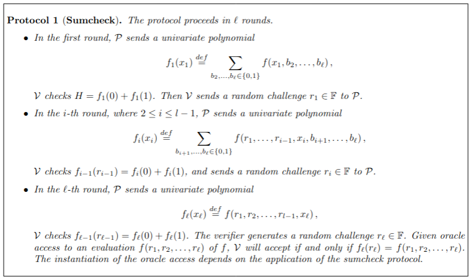

# saas
> Every ctf has to have a chall called 'saas'. Its just tradition.
### Source
```py
#!/usr/local/bin/python
from Crypto.Util.number import getPrime as gP
from random import choice, randint
p, q = gP(512), gP(512)
while p % 4 != 3:
    p = gP(512)

while q % 4 != 3:
    q = gP(512)

n = p * q
e = 0x10001

f = lambda x: ((choice([-1,1]) * pow(x, (p + 1) // 4, p)) * pow(q, -1, p) * q + (choice([-1,1]) * pow(x, (q + 1) // 4, q)) % q * pow(p, -1, q) * p) % n

while True:
    try:
        l = int(input(">>> ")) % n
        print(f(l))
    except:
        break

m = randint(0, n - 1)
print(f"{m = }")
s = int(input(">>> ")) % n
if pow(s,e,n) == m:
    print(open("flag.txt", "r").read())
else:
    print("Wrong signature!")
    exit(1)
```
The hint function `f` will let us factor n, which will allow us to easily forge RSA signatures.
```py
f = lambda x: (
    (choice([-1,1]) * pow(x, (p + 1) // 4, p)) * pow(q, -1, p) * q +
    (choice([-1,1]) * pow(x, (q + 1) // 4, q)) % q * pow(p, -1, q) * p
) % n
```
Other inputs can be used as well, but the easiest way is to just enter `1` several times since it simplifies the `pow(x, (p + 1) // 4, p)` expressions.
If `x = 1`, `f` simplifies to:

$$
(\pm 1) * (q^{-1} \bmod p) * q + (\pm 1 \bmod q) * (p^{-1} \bmod q) * p \pmod n
$$

Let's consider the 4 cases based on the `choice([-1, 1])` functions. If they're both 1, then:

$$
\begin{align*}
(q^{-1} \bmod p) * q + (p^{-1} \bmod q) * p &= 1 \pmod p \\
(q^{-1} \bmod p) * q + (p^{-1} \bmod q) * p &= 1 \pmod q \\
&= 1 \pmod n
\end{align*}
$$

Well, that's not very helpful. Let's see what happens if they're both -1.
$$
\begin{align*}
-(q^{-1} \bmod p) * q + (-1 \bmod q) * (p^{-1} \bmod q) * p &= -1 \pmod p \\
-(q^{-1} \bmod p) * q + (-1 \bmod q) * (p^{-1} \bmod q) * p &= -1 \pmod q \\
= -1 &= n - 1 \pmod n
\end{align*}
$$
Since we weren't already given $n$, this helps, but we still have to factor it. Let's try -1 and then 1.

$$
\begin{align*}
-(q^{-1} \bmod p) * q + (p^{-1} \bmod q) * p &= -1 \pmod p \\
-(q^{-1} \bmod p) * q + (p^{-1} \bmod q) * p &= 1 \pmod q \\
&= x \pmod n
\end{align*}
$$
(Similarly, we can verify that 1 and then -1 gives $1 \bmod p$ and $-1 \bmod q$). If $x = -1 \bmod p$ then $\gcd(x+1, n) = p$. Now that we know $n$ and $p$, we can forge $s = m^d$ as usual. Connect to the server:
```
>>> 1
22584873973170387532631975715183528422437016681010618464581741882284345475758086005221539371683857475009200576502143088424522374562879237368635174156835283415890738492843061847279270354725129748353239745320933642792426188606836171676085221631281998525476933677154286648781607693710919190128678155081909268088
>>> 1
57515301216124622590566072376518371083992119569511667096809751291595343959859178121431978621164550685800822333376445699489444284601257225874255447364949171605200949316779305883182575252401100832245566541186202985973093581871838640842808631676969088876776493499364932189494081880465288341782241504351251269985
>>> 1
22584873973170387532631975715183528422437016681010618464581741882284345475758086005221539371683857475009200576502143088424522374562879237368635174156835283415890738492843061847279270354725129748353239745320933642792426188606836171676085221631281998525476933677154286648781607693710919190128678155081909268088
>>> 1
80100175189295010123198048091701899506429136250522285561391493173879689435617264126653517992848408160810022909878588787913966659164136463242890621521784455021091687809622367730461845607126230580598806286507136628765519770478674812518893853308251087402253427176519218838275689574176207531910919659433160538072
>>> 
m = 53132934961200371180676162016341077654053922574943513666756222188084025661854865495927497737291401394349343056615078365876002760589653075983366529467611919986059455834413643048169959689387574237792950919554760828723038198835312635797931913782213768728290856702322316506344912730319204467752773777243157325701
>>> 20099041860533093891537787115551939590459747423543968198303933596565566658678985923271987920254172557043540713252140285247197236483427948785565652040279580299735124260366230344421118005522477491963228467520988599509254330856682864301571056119290774894214445107716375324246758240798939405391977606674070669038
.;,;.{squares_as_a_service_est_like_the_dawn_of_time}
```

(Since `801...` is the largest, we know it must be $n - 1$.)
### Final script
```py
from Crypto.Util.number import *
from math import gcd

out1 = 80100175189295010123198048091701899506429136250522285561391493173879689435617264126653517992848408160810022909878588787913966659164136463242890621521784455021091687809622367730461845607126230580598806286507136628765519770478674812518893853308251087402253427176519218838275689574176207531910919659433160538072
out2 = 57515301216124622590566072376518371083992119569511667096809751291595343959859178121431978621164550685800822333376445699489444284601257225874255447364949171605200949316779305883182575252401100832245566541186202985973093581871838640842808631676969088876776493499364932189494081880465288341782241504351251269985
m = 53132934961200371180676162016341077654053922574943513666756222188084025661854865495927497737291401394349343056615078365876002760589653075983366529467611919986059455834413643048169959689387574237792950919554760828723038198835312635797931913782213768728290856702322316506344912730319204467752773777243157325701

n = out1 + 1
p = gcd(n, out2 + 1)
q = n//p
e = 0x10001
phi = (p - 1) * (q - 1)
d = pow(e, -1, phi)
s = pow(m, d, n)

print(s)
```
Flag: `.;,;.{squares_as_a_service_est_like_the_dawn_of_time}`
# never enough
### Source
```py
from random import getrandbits
from Crypto.Cipher import AES
from hashlib import sha256
danger = 624*32 # i hear you need this much.
given = []
key = ""
for _ in range(danger//20 - 16): # should be fine if im only giving u this much :3
    x = getrandbits(32)
    # we share <3
    key += str(x % 2**12)
    given.append(x >> 12)

key = key[:100]
key = sha256(key.encode()).digest()
flag = open("flag.txt", "rb").read().strip()
cipher = AES.new(key, AES.MODE_ECB)
print(given)
print(cipher.encrypt(flag + b"\x00" * (16 - len(flag) % 16)).hex())
```
This challenge clearly involves cracking python's `random`, which is based on the mersenne twister algorithm. The script references the misconception that since the state of mersenne twister has 624 32-bit integers, you must need 624*32 bits of output in order to crack the generator, but it turns out you don't need quite this many. Fortunately, we found [a blog from rbtree](https://rbtree.blog/posts/2021-05-18-breaking-python-random-module/) (unfortunately in Korean, so we had to translate) covering a very similar challenge, so we won't really have to understand the internals of the prng. As mentioned in rbtree's post, for some reason it's impossible to recover the lower bits of the first value of the state, so we had to bruteforce $2^{12}$ values to find the first part of the key. The vast majority of the solve script was taken directly from rbtree's final code, and it takes about 2 minutes to run.
### Final script
```py
from tqdm import trange
from Crypto.Util.number import *
from hashlib import sha256
from Crypto.Cipher import AES
from Crypto.Util.Padding import unpad
import json
import random

class Twister:
    N = 624
    M = 397
    A = 0x9908b0df

    def __init__(self):
        self.state = [ [ (1 << (32 * i + (31 - j))) for j in range(32) ] for i in range(624)]
        self.index = 0
    
    @staticmethod
    def _xor(a, b):
        return [x ^ y for x, y in zip(a, b)]
    
    @staticmethod
    def _and(a, x):
        return [ v if (x >> (31 - i)) & 1 else 0 for i, v in enumerate(a) ]
    
    @staticmethod
    def _shiftr(a, x):
        return [0] * x + a[:-x]
    
    @staticmethod
    def _shiftl(a, x):
        return a[x:] + [0] * x

    def get32bits(self):
        if self.index >= self.N:
            for kk in range(self.N):
                y = self.state[kk][:1] + self.state[(kk + 1) % self.N][1:]
                z = [ y[-1] if (self.A >> (31 - i)) & 1 else 0 for i in range(32) ]
                self.state[kk] = self._xor(self.state[(kk + self.M) % self.N], self._shiftr(y, 1))
                self.state[kk] = self._xor(self.state[kk], z)
            self.index = 0

        y = self.state[self.index]
        y = self._xor(y, self._shiftr(y, 11))
        y = self._xor(y, self._and(self._shiftl(y, 7), 0x9d2c5680))
        y = self._xor(y, self._and(self._shiftl(y, 15), 0xefc60000))
        y = self._xor(y, self._shiftr(y, 18))
        self.index += 1

        return y
    
    def getrandbits(self, bit):
        return self.get32bits()[:bit]

class Solver:
    def __init__(self):
        self.equations = []
        self.outputs = []
    
    def insert(self, equation, output):
        for eq, o in zip(self.equations, self.outputs):
            lsb = eq & -eq
            if equation & lsb:
                equation ^= eq
                output ^= o
        
        if equation == 0:
            return

        lsb = equation & -equation
        for i in range(len(self.equations)):
            if self.equations[i] & lsb:
                self.equations[i] ^= equation
                self.outputs[i] ^= output
    
        self.equations.append(equation)
        self.outputs.append(output)
    
    def solve(self):
        num = 0
        for i, eq in enumerate(self.equations):
            if self.outputs[i]:
                # Assume every free variable is 0
                num |= eq & -eq
        
        state = [ (num >> (32 * i)) & 0xFFFFFFFF for i in range(624) ]
        return state

num = ((624 * 32)//20 - 16)
bit = 20
twister = Twister()

with open('out.txt') as f:
    lines = f.readlines()
    outputs = json.loads(lines[0])
    enc = bytes.fromhex(lines[1])

equations = [ twister.getrandbits(bit) for _ in range(num) ]

solver = Solver()
for i in trange(num):
    for j in range(bit):
        #print(i, j)
        solver.insert(equations[i][j], (outputs[i] >> (bit - 1 - j)) & 1)

state = solver.solve()
recovered_state = (3, tuple(state + [0]), None)
random.setstate(recovered_state)

for i in range(num):
    assert outputs[i] == (random.getrandbits(bit))

for i in range(2**12): # brute force the first output of the key
    random.setstate(recovered_state)
    random.getrandbits(32)
    key = ""
    for _ in range(30):
        x = random.getrandbits(32)
        key += str(x % 2**12)

    length = len(str(i))
    key = str(i) + key[0:100 - length]
    assert len(key) == 100
    key = sha256(key.encode()).digest()
    cipher = AES.new(key, AES.MODE_ECB)
    dec = cipher.decrypt(enc)
    if b'.;,;.' in dec:
        print(dec.rstrip(b'\x00').decode('ascii'))
        break
```
Flag: `.;,;.{never_enough_but_you_gotta_just_make_more_or_something_idk_im_not_a_motivational_speaker_but_you_get_the_idea}`
# LCGs are SBGs
TODO (or is wjat doing this or something)
# sums
> I have a funny game, unfortunately the odds of you winning are basically 0, but I'm bored, so play with me and I'll give you a flag if you win.

This challenge is a bit more complicated, but the main code is in `sums.py`. The Dockerfile has a reference to https://github.com/tsunrise/sumcheck_multilinear/, which has most of the other files along with the [associated paper](https://eprint.iacr.org/2019/317.pdf).
### Source
```py
#!/usr/local/bin/python
from IPVerifier import InteractiveVerifier
from IPProverLinear import InteractiveLinearProver
from polynomial import randomMVLinear
from random import randint
P = 2**256 - 189
NUM_VARS = 10
seed = randint(0, 2**64)
tries = 3
verifier = InteractiveVerifier(seed, randomMVLinear(10, P), 0)
def prime_verifier(poly, s_claim):
    global verifier
    verifier.poly = poly
    verifier.asserted_sum = s_claim % P
    verifier.active = True
    verifier.convinced = False
    verifier.round = 0
    verifier.expect = s_claim % P

def random_poly():
    poly = randomMVLinear(10, P)
    return poly


def do_run():
    global tries
    poly = random_poly()
    while (s_actual:=InteractiveLinearProver(poly).calculateTable()[1]) == 1337:
        poly = random_poly()
    print("Polynomial: ", poly.terms)
    s_claim = int(input("Enter the sum: "))
    prime_verifier(poly, s_claim)
    p0 = int(input("Enter P(0): ")) % P
    p1 = int(input("Enter P(1): ")) % P
    res = verifier.talk(p0, p1)
    if not res[0]:
        print("CHEATER!")
        return False
    print("Your odds: ", verifier.soundnessError())
    play = input("Do you want to play? (y/n): ")
    if play != "y":
        print("Bye")
        return False
    tries -= 1
    while verifier.active:
        print(f"challenge: {res}")
        p0 = int(input("Enter P(0): ")) % P
        p1 = int(input("Enter P(1): ")) % P
        res = verifier.talk(p0, p1)
        if not res[0]:
            print("CHEATER!")
            return False
    if not verifier.convinced:
        return False
    
    if s_claim != s_actual and s_claim == 1337:
        print("Wow...")
        return True
    return False # congrats, you played and lost...

def main():
    while tries:
        if do_run():
            print("Hmm, you won my game?")
            print("Flag: " + open("flag.txt", "r").read())
            break
        else:
            print("Skissue + get good")
            print("You have {} tries left".format(tries))
    


if __name__ == "__main__":
    main()
```

The challenge implements the SumCheck protocol, where we take the role of the prover and attempt to convince the verifier that the sum of a certain polynomial is `1337`. Most of [the paper](https://eprint.iacr.org/2019/317.pdf) isn't that important, but it's worth looking at the table in section 2.3 to get a general understanding of the protocol.

In each run, the code sends `f`, a randomly generated multilinear polynomial in 10 variables. A multilinear polynomial is a polynomial that's linear in each of its variables separately, but not necessarily linear as a whole. For example, $f(x, y) = xy + 3x$ is multilinear but $f(x, y) = y^2 + 3x$ isn't. When generating the polynomial, the script verifies that the sum $\sum_{b_1, \dots, b_{10} \in \{0,1\}} f(b_1, b_2, \ldots, b_{10}) \neq 1337$ in the while loop, but if we want to get the flag we have to claim that the sum is 1337. Then, just like in the protocol, we send $f_1(0)$ and $f_1(1)$ and in `verifier.talk(p0, p1)` the script verifies that our claimed `s_claim` is equal to `p0 + p1`. Then it asks if we want to play the game, and if so the protocol continues as in the paper. Note that one of our 3 tries is used up only if we decide to play.

### The vuln
We already know from never enough that python's random module is inherently weak, so it is interesting to see a seed given to the `InteractiveVerifier`. From the source code in `IPVerifier.py` below, we can verify that python's random module is being used with the given seed.
```py
"""
Interactive Verifier of Multilinear Polynomial Sum
Tom Shen
"""
import math
from random import Random
from typing import List, Tuple

from polynomial import MVLinear

DEFAULT_MAX_ALLOWED_SOUNDNESS_ERROR = 2 ** (-32)


class InteractiveVerifier:
    """
    An interactive verifier that verifies the sum of the multi-linear polynomial
    """

    def __init__(self, seed: int, polynomial: MVLinear, asserted_sum: int,
                 maxAllowedSoundnessError: float = DEFAULT_MAX_ALLOWED_SOUNDNESS_ERROR):
        """
        Initialize the protocol of the verifier.
        :param seed: the random source
        :param polynomial: The multilinear function
        :param asserted_sum: The proposed sum (0 and 1) of the multilinear function (which is to be verified)
        :param maxAllowedSoundnessError: the maximum soundness error allowed
        """
        self.p: int = polynomial.p
        """
        The field size
        """
        self.poly: MVLinear = polynomial
        self.asserted_sum: int = asserted_sum % self.p
        self.rand: Random = Random()
        self.rand.seed(seed)

        self.active: bool = True
        self.convinced: bool = False

        # check soundness
        if self.soundnessError() > maxAllowedSoundnessError:
            raise SoundnessErrorException(f"Soundness error {self.soundnessError()} exceeds maximum "
                                          f"allowed soundness error {maxAllowedSoundnessError}\n"
                                          f"Try to have a prime "
                                          f"with size "
                                          f">= {self.requiredFieldLengthBit(maxAllowedSoundnessError)} bits")

        # some edge case: if univariate or constant: no need to be interactive
        if polynomial.num_variables == 0:
            if (asserted_sum - polynomial.eval([])) % self.p == 0:
                self._convince_and_close()
                return
            else:
                self._reject_and_close()
                return
        if polynomial.num_variables == 1:
            result = (polynomial.eval([0]) + polynomial.eval([1])) % self.p
            if (asserted_sum - result) % self.p == 0:
                self._convince_and_close()
                return
            else:
                self._reject_and_close()
                return

        self.points: List[int] = [0] * self.poly.num_variables
        """
        the fixed points that are already decided by the verifier. At round i, [0, i-1] are decided
        """

        self.round: int = 0
        """
        which variable the verifier is summing (at round i, var 0 to var (i-1) is fixed, and the verifier is listening 
        to the univariate function of variable i where var[i+1, n] is summed over.  
        """

        self.expect: int = self.asserted_sum
        """
        The expected sum value at round i
        """

    def soundnessError(self) -> float:
        """
        Get the soundness error according to the MVLinear and field size.
        :return: The float representing the upper bound of probability of accepting when assertion is invalid.
        """

        n = self.poly.num_variables
        return (n * n) / self.p

    def requiredFieldLengthBit(self, e: float) -> int:
        """
        :param e: the maximum allowed soundness error
        :return: The minimum size of prime required to meet the soundness error constraint.
        """
        n = self.poly.num_variables
        minP = (n * n) / e
        return math.ceil(math.log(minP, 2)) + 1

    def randomR(self) -> int:
        return self.rand.randint(0, self.p)

    def talk(self, p0: int, p1: int) -> Tuple[bool, int]:
        """
        Send the verifier the univariate linear polynomial P(x).
        At round i, P(x) = sum over b: P(r_1, ..., r_i-1, x, b_i+1, b_i+2, ...)
        where r is fixed (as proposed by self.points)
        :param p0: P(0)
        :param p1: P(1)
        :return: a tuple (accept?, random r for x). If accept? is false, the returned integer is meaningless.
        """

        # if the protocol is not active, throw an error
        if not self.active:
            raise RuntimeError("Unable to prove: the protocol is not active. ")

        # check that P(0) + P(1) is in fact self.expect
        p0 %= self.p
        p1 %= self.p
        if (p0 + p1) % self.p != self.expect % self.p:
            self._reject_and_close()
            return False, 0

        # pick r at random
        r: int = self.randomR()
        pr: int = (p0 + r * (p1 - p0)) % self.p  # gradient formula
        self.expect = pr
        self.points[self.round] = r

        # if not final step, end here
        if not (self.round + 1 == self.poly.num_variables):
            self.round += 1
            return True, r

        # final step: check all
        final_sum = self.poly.eval(self.points)
        if pr != final_sum:
            self._reject_and_close()
            return False, 0
        self._convince_and_close()
        return True, 0

    def _convince_and_close(self):
        """
        Accept the sum. Close the protocol.
        """
        self.convinced = True
        self.active = False

    def _reject_and_close(self):
        """
        Reject the sum. Close the protocol
        """
        self.convinced = False
        self.active = False


class SoundnessErrorException(Exception):
    pass
```
In the code, the random function is only used in `self.randomR()`. If we are able to know future `r` values before they're produced, it seems like we'd be able to falsely convince the verifier that the sum if 1337. So we now need to consider how many outputs of the rng we're able to get. `self.randomR()` returns `self.rand.randint(0, self.p)`, and since `P = 2**256 - 189` it is essentially the same as `getrandbits(256)`. Mersenne twister contains a state of 624 32-bit numbers, so for each `r` we're given 8 outputs of the rng. Then, in each run the verifier sends us 9 `r` values (a 10th `r` is generated, but never sent), and there are 3 runs in total. So we're given `9*8*3 = 216` outputs, which clearly isn't enough to fully reconstruct the state of length 624. Fortunately, we don't actually have to reconstruct the entire state to predict a few outputs. It turns out we only need to predict $r_{10}$ to be able to fool the verifier. Anyway, let's take a look at the source code for python's random.
```c
/* Period parameters -- These are all magic.  Don't change. */
#define N 624
#define M 397
#define MATRIX_A 0x9908b0dfU    /* constant vector a */
#define UPPER_MASK 0x80000000U  /* most significant w-r bits */
#define LOWER_MASK 0x7fffffffU  /* least significant r bits */

static uint32_t
genrand_uint32(RandomObject *self)
{
    uint32_t y;
    static const uint32_t mag01[2] = {0x0U, MATRIX_A};
    /* mag01[x] = x * MATRIX_A  for x=0,1 */
    uint32_t *mt;

    mt = self->state;
    if (self->index >= N) { /* generate N words at one time */
        int kk;

        for (kk=0;kk<N-M;kk++) {
            y = (mt[kk]&UPPER_MASK)|(mt[kk+1]&LOWER_MASK);
            mt[kk] = mt[kk+M] ^ (y >> 1) ^ mag01[y & 0x1U];
        }
        for (;kk<N-1;kk++) {
            y = (mt[kk]&UPPER_MASK)|(mt[kk+1]&LOWER_MASK);
            mt[kk] = mt[kk+(M-N)] ^ (y >> 1) ^ mag01[y & 0x1U];
        }
        y = (mt[N-1]&UPPER_MASK)|(mt[0]&LOWER_MASK);
        mt[N-1] = mt[M-1] ^ (y >> 1) ^ mag01[y & 0x1U];

        self->index = 0;
    }

    y = mt[self->index++];
    y ^= (y >> 11);
    y ^= (y << 7) & 0x9d2c5680U;
    y ^= (y << 15) & 0xefc60000U;
    y ^= (y >> 18);
    return y;
}
```
As we can see, the mt state has length 624, and once 624 random numbers have been generated, it generates a new state within the for loops. Then whenever we generate a random number, it takes the number from the state and applies the xor operations called tempering. Thankfully, the process is invertible, so we can get a number in the state from the output `y` and vice versa. The untemper functions were taken from [rbtree's blog](https://rbtree.blog/posts/2021-05-18-breaking-python-random-module/).

```py
TemperingMaskB = 0x9d2c5680
TemperingMaskC = 0xefc60000

def temper(y):
    y ^= (y >> 11)
    y ^= (y << 7) & TemperingMaskB
    y ^= (y << 15) & TemperingMaskC
    y ^= (y >> 18)
    return y

def untemper(y):
    y = undoTemperShiftL(y)
    y = undoTemperShiftT(y)
    y = undoTemperShiftS(y)
    y = undoTemperShiftU(y)
    return y

def undoTemperShiftL(y):
    last14 = y >> 18
    final = y ^ last14
    return final

def undoTemperShiftT(y):
    first17 = y << 15
    final = y ^ (first17 & TemperingMaskC)
    return final

def undoTemperShiftS(y):
    a = y << 7
    b = y ^ (a & TemperingMaskB)
    c = b << 7
    d = y ^ (c & TemperingMaskB)
    e = d << 7
    f = y ^ (e & TemperingMaskB)
    g = f << 7
    h = y ^ (g & TemperingMaskB)
    i = h << 7
    final = y ^ (i & TemperingMaskB)
    return final

def undoTemperShiftU(y):
    a = y >> 11
    b = y ^ a
    c = b >> 11
    final = y ^ c
    return final
```
Here is the for loop in the source code that generates the first part of a new state.
```c
        for (kk=0;kk<N-M;kk++) {
            y = (mt[kk]&UPPER_MASK)|(mt[kk+1]&LOWER_MASK);
            mt[kk] = mt[kk+M] ^ (y >> 1) ^ mag01[y & 0x1U];
        }
```
Notice `mt[i]` only depends on the previous `mt[i]`, `mt[i+1]`, and `mt[i+M]` (where `M = 397`). Also notice that an `r` is generated in the verifier script even if we respond `n` when asked if we want to play the game. Though we can't actually see the generated `r`, the fact that we can force the script to generate an `r` means we can progress through the state of the rng. Since we get 3 tries this means:
- First try: we can submit whatever data to gather the `r` values based on `mt[i]`
- Second try: we want to gather the `r` values generated around `mt[M]`, so before our second try we should refuse to play the game about 39 times, since that means mersenne twister would have generated 49*8 = 392 values in total.
- Third try: using the data from `mt[0:72]` and `mt[392:464]`, we can compute about `mt[0:64]` in the new state. Thus we will refuse to play the game around 15 more times, so that somewhere through our third try the new mersenne twister state will be generated. Then we will be able to predict $r_{10}$ and fool the verifier

Now there is only one more detail to figure out. How do we actually fool the verifier if we can predict $r_{10}$?
```py
    def talk(self, p0: int, p1: int) -> Tuple[bool, int]:
        """
        Send the verifier the univariate linear polynomial P(x).
        At round i, P(x) = sum over b: P(r_1, ..., r_i-1, x, b_i+1, b_i+2, ...)
        where r is fixed (as proposed by self.points)
        :param p0: P(0)
        :param p1: P(1)
        :return: a tuple (accept?, random r for x). If accept? is false, the returned integer is meaningless.
        """

        # if the protocol is not active, throw an error
        if not self.active:
            raise RuntimeError("Unable to prove: the protocol is not active. ")

        # check that P(0) + P(1) is in fact self.expect
        p0 %= self.p
        p1 %= self.p
        if (p0 + p1) % self.p != self.expect % self.p:
            self._reject_and_close()
            return False, 0

        # pick r at random
        r: int = self.randomR()
        pr: int = (p0 + r * (p1 - p0)) % self.p  # gradient formula
        self.expect = pr
        self.points[self.round] = r

        # if not final step, end here
        if not (self.round + 1 == self.poly.num_variables):
            self.round += 1
            return True, r

        # final step: check all
        final_sum = self.poly.eval(self.points)
        if pr != final_sum:
            self._reject_and_close()
            return False, 0
        self._convince_and_close()
        return True, 0
```
The talk function is used to verify each of our inputs according to the protocol. When we make our third attempt, we clearly want to claim that the sum is 1337. For every round before the final round, all we need to do is supply `p0` and `p1` such that `p0 + p1 == self.expect mod p`. Personally, I just made `p0` and `p1` equal so that I wouldn't have to deal with `pr` depending on `r`. For the last round, still we have that `p0 + p1 == self.expect mod p`, but now we also must make `pr == final_sum == 1337`. Notice that the final `r` is never sent to the prover, so there would be essentially no chance of coming up with the same final sum. Since we do have `r`, we can just solve the equations for `p0` and `p1`.

$$
\begin{align*}
p_0 + p_1 &= \mathrm{self.expect} \pmod P \\
p_0 + r * (p_1 - p_0) &= \mathrm{actual\_sum} \pmod P
\end{align*}
$$
### Final Script
The script takes almost 5 minutes because of the amount of time the server spends generating random polynomials that we don't actually care about. Anyway this was a very fun chall.
```py
from pwn import *
from tqdm import trange
from polynomial import MVLinear

P = 2**256 - 189
io = remote('smiley.cat', 44873, level='error')

TemperingMaskB = 0x9d2c5680
TemperingMaskC = 0xefc60000

def temper(y):
    y ^= (y >> 11)
    y ^= (y << 7) & TemperingMaskB
    y ^= (y << 15) & TemperingMaskC
    y ^= (y >> 18)
    return y

def untemper(y):
    y = undoTemperShiftL(y)
    y = undoTemperShiftT(y)
    y = undoTemperShiftS(y)
    y = undoTemperShiftU(y)
    return y

def undoTemperShiftL(y):
    last14 = y >> 18
    final = y ^ last14
    return final

def undoTemperShiftT(y):
    first17 = y << 15
    final = y ^ (first17 & TemperingMaskC)
    return final

def undoTemperShiftS(y):
    a = y << 7
    b = y ^ (a & TemperingMaskB)
    c = b << 7
    d = y ^ (c & TemperingMaskB)
    e = d << 7
    f = y ^ (e & TemperingMaskB)
    g = f << 7
    h = y ^ (g & TemperingMaskB)
    i = h << 7
    final = y ^ (i & TemperingMaskB)
    return final

def undoTemperShiftU(y):
    a = y >> 11
    b = y ^ a
    c = b >> 11
    final = y ^ c
    return final

def r_to_32(r):
    # converts the raw r values to 8 32-bit rng outputs
    binary = bin(r)[2:].zfill(256)
    return [int(binary[32*i:32*i+32], 2) for i in range(8)][::-1]

def flatten(xss):
    # flattens list
    return [x for xs in xss for x in xs]

N = 624
M = 397
MATRIX_A = 0x9908b0df
UPPER_MASK = 0x80000000
LOWER_MASK = 0x7fffffff

def gen_next_state(first_part, second_part):
    # first part of state is mt[0:length]
    # second part of state is mt[M:M+length]
    # this will generate new mt[0:length-1]

    assert len(first_part) == len(second_part)

    mag01 = [0x0, MATRIX_A]

    mt = []
    for i in range(len(first_part) - 1):
        y = (first_part[i]&UPPER_MASK) | (first_part[i+1]&LOWER_MASK)
        mt.append(second_part[i] ^ (y >> 1) ^ mag01[y & 0x1])

    return mt

def gen_next_random_values(state):
    # state is list of 64
    # this will generate next 8 r-values
    nums = [temper(i) for i in state]

    rs = []
    for i in range(len(state)//8):
        r_nums = nums[i*8:i*8+8]
        r = int(''.join([bin(i)[2:].zfill(32) for i in r_nums][::-1]), 2)
        rs.append(r)

    return rs

def send_values(p0, p1):
    io.sendlineafter(b"Enter P(0):", str(p0).encode())
    io.sendlineafter(b"Enter P(1):", str(p1).encode())

def gen_ps(expected_sum):
    # finds p0 and p1 such that p0 + p1 == expected_sum (and p0 == p1)
    if expected_sum % 2 == 0:
        return expected_sum // 2
    else:
        return (expected_sum + P) // 2

def parse_poly(line):
    return MVLinear(10, eval(line.strip("Polynomial: ")), P)

def round_loop(play, last_r=0):
    poly = parse_poly(io.recvline().decode('ascii'))

    expect = 1337
    io.sendlineafter(b"Enter the sum:", str(expect).encode())

    p = gen_ps(expect)
    send_values(p, p)
    expect = p

    line = io.recvuntil(b"Do you want to play? (y/n):")
    if play:
        io.sendline(b"y")
    else:
        io.sendline(b"n")
        io.recvline()
        io.recvline()
        io.recvline()
        return None

    rs = []

    for i in range(8):
        challenge = eval(io.recvline()[12:-1])
        assert challenge[0] == True
        r = challenge[1]
        rs.append(r)

        p = gen_ps(expect)
        send_values(p, p)
        expect = p

    challenge = eval(io.recvline()[12:-1])
    assert challenge[0] == True
    r = challenge[1]
    rs.append(r)
    assert len(rs) == 9

    if last_r == 0:
        p = gen_ps(expect)
        send_values(p, p)
        expect = p
    else:
        rs.append(last_r)
        actual_sum = poly.eval(rs)
        p0 = ((actual_sum - last_r*expect) * pow(1 - 2*last_r, -1, P)) % P
        p1 = (expect - p0) % P
        assert (p0 + last_r * (p1 - p0)) % P == actual_sum
        assert (p0 + p1) % P == expect
        send_values(p0, p1)

    print(io.recvline().decode('ascii'))
    print(io.recvline().decode('ascii'))
    print(io.recvline().decode('ascii'))
    return rs

first_part = round_loop(True)
first_part = flatten([r_to_32(i) for i in first_part])
first_part = [untemper(i) for i in first_part][:-5]

ignore = [round_loop(False) for _ in trange(39)]

second_part = round_loop(True)
second_part = flatten([r_to_32(i) for i in second_part])
second_part = [untemper(i) for i in second_part][5:]

ignore = [round_loop(False) for _ in trange(15)]
next_state = gen_next_state(first_part, second_part)[:64]
next_rs = gen_next_random_values(next_state)
next_last_r = next_rs[5]

final_play = round_loop(True, next_last_r)
```
Flag: `.;,;.{sumcheck_needs_secure_random...}`